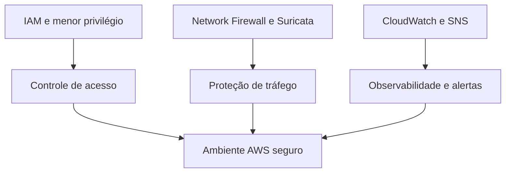

# AWS Cloud Labs Portfolio

Portfólio técnico de **José Airton de Carvalho Neto**, desenvolvido durante a formação AWS re/Start. O repositório reúne três laboratórios práticos de segurança, redes e observabilidade na AWS.

## Projetos

| Laboratório | Serviços | Resultado |
|---|---|---|
| [IAM: usuários e menor privilégio](labs/01-iam-access-control/) | IAM, EC2, S3 | Acessos separados por função e permissões validadas |
| [Network Firewall com Suricata](labs/02-network-firewall-suricata/) | VPC, Network Firewall, Systems Manager | URLs maliciosas bloqueadas por regras stateful |
| [Monitoramento de CPU](labs/03-cloudwatch-sns-monitoring/) | EC2, CloudWatch, SNS, Systems Manager | Alarme disparado e notificação entregue por e-mail |

## Visão de arquitetura

## Competências demonstradas

- Administração de usuários, grupos e políticas IAM;
- Aplicação do princípio do menor privilégio;
- Inspeção stateful de tráfego com regras compatíveis com Suricata;
- Monitoramento de métricas EC2 com Amazon CloudWatch;
- Alertas orientados a eventos com Amazon SNS;
- Testes positivos e negativos para validação técnica;
- Registro de evidências e documentação de laboratório.

## Segurança e privacidade

As evidências foram sanitizadas antes da publicação. E-mails, IDs de conta, identificadores de sessão e outros dados desnecessários foram removidos ou ocultados. Os ambientes utilizados eram temporários e destinados exclusivamente ao treinamento autorizado.

## Uso de inteligência artificial

Os laboratórios foram executados pelo autor. Ferramentas de IA foram utilizadas como apoio didático, revisão textual e organização da documentação. As decisões, configurações e validações foram conferidas durante a execução prática.

## Autor

**José Airton de Carvalho Neto**  
AWS re/Start — Escola da Nuvem  
[LinkedIn](https://www.linkedin.com/in/jose-airton-cloud)

