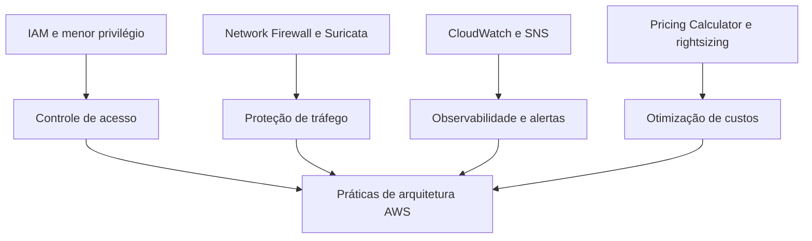

# AWS Cloud Labs Portfolio

Portfólio técnico de **José Airton de Carvalho Neto**, desenvolvido durante a formação AWS re/Start e em atividades práticas do AWS Skill Builder.

O repositório reúne quatro laboratórios relacionados a identidade e acesso, segurança de redes, observabilidade e otimização de custos na AWS.

## Projetos

| Laboratório                                                                | Serviços e ferramentas                         | Resultado                                                               |
| -------------------------------------------------------------------------- | ---------------------------------------------- | ----------------------------------------------------------------------- |
| [IAM: usuários e menor privilégio](labs/01-iam-access-control/)            | IAM, EC2, S3                                   | Acessos separados por função e permissões validadas                     |
| [Network Firewall com regras Suricata](labs/02-network-firewall-suricata/) | VPC, AWS Network Firewall, Systems Manager     | URLs maliciosas bloqueadas por regras stateful compatíveis com Suricata |
| [Monitoramento de CPU](labs/03-cloudwatch-sns-monitoring/)                 | EC2, CloudWatch, SNS, Systems Manager          | Alarme disparado e notificação entregue por e-mail                      |
| [Otimização de custos na nuvem](labs/04-cloud-cost-optimization/)          | AWS Pricing Calculator, EC2, EBS, Auto Scaling | Estimativa otimizada por rightsizing, com redução aproximada de 62,4%   |

## Visão de arquitetura

## Competências demonstradas

* Administração de usuários, grupos e políticas IAM;
* Aplicação do princípio do menor privilégio;
* Inspeção stateful de tráfego com regras compatíveis com Suricata;
* Monitoramento de métricas do Amazon EC2 com Amazon CloudWatch;
* Alertas orientados a eventos com Amazon SNS;
* Criação de estimativas com o AWS Pricing Calculator;
* Modelagem de carga base e períodos de pico;
* Comparação entre On-Demand, Savings Plans e Spot;
* Análise de custos do Amazon EC2, Amazon EBS e transferência de dados;
* Aplicação do conceito de rightsizing;
* Análise de decisões técnicas e trade-offs;
* Testes positivos e negativos para validação técnica;
* Registro de evidências e documentação de laboratórios.

## Segurança e privacidade

As evidências foram revisadas antes da publicação. E-mails, IDs de conta, identificadores de sessão, credenciais e outros dados desnecessários foram removidos ou ocultados.

Os ambientes provisionados eram temporários e destinados exclusivamente ao treinamento autorizado. O laboratório de otimização de custos utilizou o AWS Pricing Calculator e não provisionou recursos em uma conta AWS.

## Uso de inteligência artificial

Os laboratórios foram executados pelo autor. Ferramentas de inteligência artificial foram utilizadas como apoio didático, revisão textual e organização da documentação.

As configurações, decisões e validações foram conferidas pelo autor durante a execução prática.

## Autor

**José Airton de Carvalho Neto**
AWS re/Start — Escola da Nuvem
[LinkedIn](https://www.linkedin.com/in/jose-airton-cloud)
