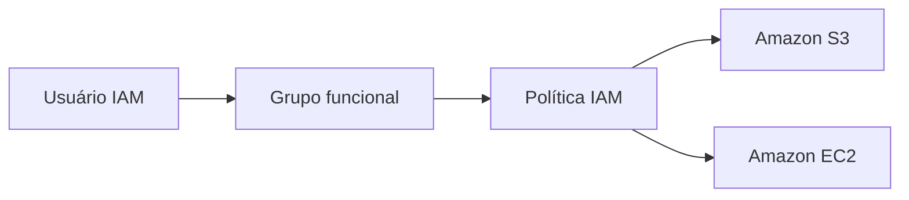

# Gerenciamento de usuários e permissões com AWS IAM

## Objetivo

Implementar controle de acesso baseado em funções, concedendo somente as permissões necessárias para equipes simuladas de suporte ao Amazon S3, suporte ao Amazon EC2 e administração do EC2.

## Arquitetura lógica

## Implementação

- Política de senha com mínimo de 10 caracteres, complexidade, expiração em 90 dias e histórico de cinco senhas;
- Grupo `S3-Support` com `AmazonS3ReadOnlyAccess`;
- Grupo `EC2-Support` com `AmazonEC2ReadOnlyAccess`;
- Grupo `EC2-Admin` com política em linha específica;
- Associação dos usuários aos respectivos grupos;
- Testes de autenticação e autorização com ações permitidas e bloqueadas.

## Resultado

As permissões foram herdadas corretamente pelos grupos. Usuários de suporte permaneceram em modo somente leitura, enquanto o usuário administrativo conseguiu executar a ação autorizada no EC2.

## Decisões e limitações

Políticas gerenciadas simplificam o laboratório, mas podem conceder um escopo maior que o necessário em produção. Em um ambiente real, a evolução recomendada inclui políticas por recurso, MFA, credenciais temporárias, AWS IAM Identity Center e auditoria com CloudTrail.

## Evidências e relatório

- [Relatório completo em PDF](report.pdf)
- [Evidências sanitizadas](evidence/)

[Voltar ao portfólio](../../README.md)

