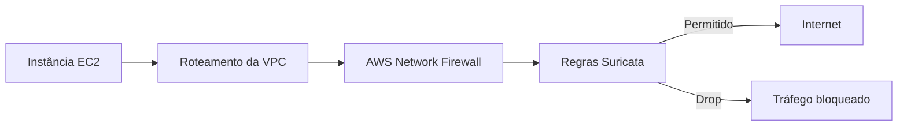

# Bloqueio de URLs maliciosas com AWS Network Firewall e Suricata

## Objetivo

Proteger o tráfego de saída de uma instância EC2 por meio de inspeção stateful e bloquear duas URLs de teste classificadas como maliciosas.

## Fluxo

## Implementação

- Validação inicial do acesso HTTP com `wget`;
- Alteração da política para encaminhar pacotes à inspeção stateful;
- Criação do grupo `StatefulRuleGroup`, capacidade 100;
- Duas regras compatíveis com Suricata usando ação `drop`;
- Associação do grupo personalizado à `LabFirewallPolicy`;
- Confirmação da sincronização entre firewall, política e grupo;
- Repetição dos downloads para validar o bloqueio.

## Resultado

Antes da proteção, os dois arquivos eram baixados com sucesso. Após a associação das regras, as conexões permaneceram sem resposta até serem interrompidas, confirmando o bloqueio do tráfego correspondente.

## Decisões e limitações

O laboratório utiliza HTTP para tornar o conteúdo da requisição visível à inspeção. Em HTTPS, a análise de URI exige arquitetura adicional, como inspeção TLS autorizada. Regras personalizadas também precisam de gestão de falsos positivos, logs e processo controlado de atualização.

## Evidências e relatório

- [Relatório completo em PDF](report.pdf)
- [Evidências sanitizadas](evidence/)

[Voltar ao portfólio](../../README.md)

