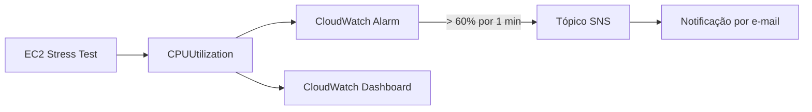

# Monitoramento e alertas de CPU em uma instância EC2

## Objetivo

Criar um fluxo de observabilidade capaz de detectar utilização elevada de CPU em uma instância EC2 e notificar o responsável por e-mail.

## Fluxo de observabilidade

## Implementação

- Criação do tópico SNS `MyCwAlarm`;
- Assinatura por e-mail e confirmação do endpoint;
- Alarme `LabCPUUtilizationAlarm` sobre a métrica `CPUUtilization`;
- Estatística média, período de um minuto e limite superior a 60%;
- Execução controlada de `stress --cpu 10 --timeout 400s`;
- Verificação da CPU em 100% pelo terminal;
- Validação do estado `Em alarme`, do e-mail recebido e do dashboard.

## Resultado

O teste elevou a utilização de CPU para aproximadamente 100%. O CloudWatch detectou a violação, alterou o estado do alarme e publicou no SNS. A notificação registrou um valor próximo de 99,73%.

## Decisões e limitações

Uma janela de um minuto acelera a demonstração, mas pode gerar ruído em produção. Sistemas reais normalmente usam múltiplos pontos de dados, tratamento explícito de dados ausentes, severidades, runbooks e canais de escalonamento. O alarme deste laboratório apenas notifica; não executa recuperação automática.

## Evidências e relatório

- [Relatório completo em PDF](report.pdf)
- [Evidências sanitizadas](evidence/)

[Voltar ao portfólio](../../README.md)

