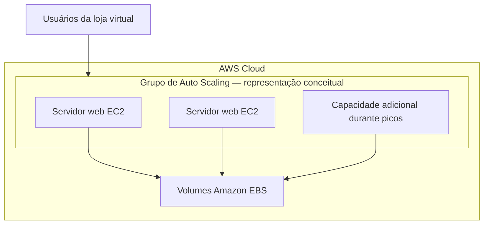
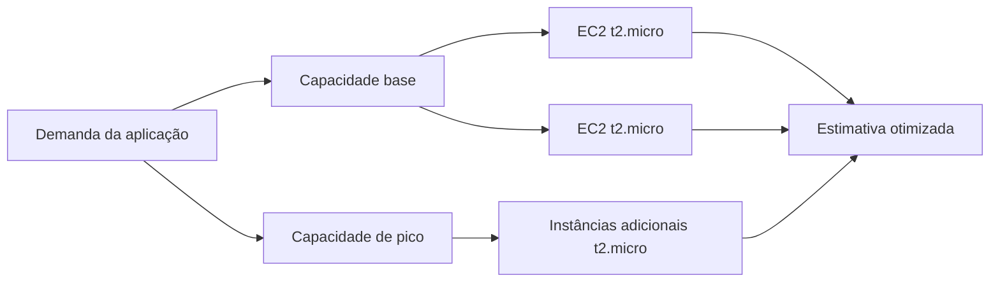

# AWS SimuLearn — Economias na Nuvem


## Visão geral

Neste laboratório do AWS SimuLearn, disponível no AWS Skill Builder, utilizei o AWS Pricing Calculator para estimar o custo mensal de uma carga de trabalho web executada no Amazon EC2.

A atividade incluiu a configuração da carga de trabalho, do armazenamento Amazon EBS e da transferência de dados. Também apliquei o conceito de rightsizing para comparar os custos das instâncias `t3.medium` e `t2.micro`.

> Este laboratório produziu uma estimativa de custos. Nenhuma infraestrutura foi provisionada em uma conta AWS.

---

## Cenário

O cenário apresentava uma loja virtual de produtos de surfe que precisava estimar os custos de uma arquitetura escalável.

A solução deveria suportar:

- uma carga base de usuários;
- períodos diários de maior demanda;
- servidores web executados no Amazon EC2;
- armazenamento persistente no Amazon EBS;
- entrada e saída de dados pela internet.

O objetivo comercial era encontrar uma configuração capaz de acompanhar as variações da demanda, evitando o superdimensionamento e o pagamento por capacidade ociosa.

---

## Objetivos

- Criar uma estimativa no AWS Pricing Calculator.
- Calcular o custo dos servidores web no Amazon EC2.
- Modelar uma carga base e períodos de pico.
- Considerar o armazenamento Amazon EBS.
- Considerar a transferência de dados.
- Comparar diferentes modelos de compra do EC2.
- Aplicar rightsizing na carga de trabalho.
- Substituir a instância `t3.medium` pela `t2.micro`.
- Gerar e compartilhar uma nova estimativa.
- Validar a solução no AWS SimuLearn.

---

## Serviços, ferramentas e conceitos

| Item | Utilização no laboratório |
|---|---|
| AWS SimuLearn | Ambiente de aprendizagem e validação |
| AWS Skill Builder | Plataforma que disponibilizou a atividade |
| AWS Pricing Calculator | Criação da estimativa de custos |
| Amazon EC2 | Computação dos servidores web |
| Amazon EBS | Armazenamento em blocos das instâncias |
| EC2 Auto Scaling | Conceito utilizado para representar variação de capacidade |
| Rightsizing | Adequação do tamanho da instância |
| Savings Plans | Modelo de desconto baseado em compromisso de uso |
| Instâncias Spot | Capacidade ociosa com preço variável e possibilidade de interrupção |

---

## Arquitetura conceitual

A arquitetura apresentada no laboratório representa servidores web com capacidade ajustável de acordo com a demanda.



> O laboratório utilizou essa arquitetura como cenário para estimativa. Um grupo de Auto Scaling real não foi criado.

---

## Modelo de demanda

A carga de trabalho foi modelada com capacidade base e aumento de capacidade durante períodos de pico.

| Parâmetro | Configuração |
|---|---:|
| Capacidade base | 2 instâncias |
| Capacidade durante o pico | 4 instâncias |
| Duração do pico | 8 horas por dia |
| Dias de operação | Domingo a sábado |
| Instâncias permanentes | 730 horas mensais por instância |
| Instâncias adicionais | Aproximadamente 243,33 horas mensais por instância |
| Total calculado | Aproximadamente 1.946,67 horas de instância por mês |

### Interpretação

Duas instâncias representam a capacidade base e permanecem disponíveis durante todo o mês. Durante oito horas por dia, duas instâncias adicionais representam o aumento necessário para atender aos períodos de pico.

---

## Configuração inicial da estimativa

### Amazon EC2

| Parâmetro | Valor |
|---|---|
| Região | US East — Norte da Virgínia |
| Sistema operacional | Linux |
| Tipo de locação | Instâncias compartilhadas |
| Tipo inicial | `t3.medium` |
| Modelo de compra | Sob demanda |
| Carga de trabalho | Carga base com pico diário |
| Custo EC2 calculado | Aproximadamente US$ 80,98/mês |

### Amazon EBS

| Parâmetro | Valor |
|---|---|
| Tipo de volume | SSD de uso geral `gp3` |
| Capacidade configurada | 10 GB por instância |
| Snapshots | Não configurados |

### Transferência de dados

| Fluxo | Quantidade | Custo calculado |
|---|---:|---:|
| Entrada pela internet | 1 TB/mês | US$ 0,00 |
| Transferência inter-regional | Não configurada | US$ 0,00 |
| Saída para a internet | 100 GB/mês | US$ 9,00 |

### Resultado inicial

O custo mensal total da primeira estimativa foi de aproximadamente:

**US$ 93,66 por mês**

---

## Comparação dos modelos de compra

O AWS Pricing Calculator apresentou diferentes possibilidades de aquisição de capacidade computacional.

### Sob demanda

- Não exige compromisso de longo prazo.
- Oferece maior flexibilidade.
- É adequada para cargas imprevisíveis ou de curta duração.
- Pode apresentar custo maior em uso contínuo.

### Compute Savings Plans

- Exigem compromisso de uso por um ou três anos.
- Oferecem flexibilidade entre EC2, AWS Lambda e AWS Fargate.
- Podem reduzir custos em cargas previsíveis.

### EC2 Instance Savings Plans

- Exigem compromisso com uma família de instâncias em uma região.
- Podem oferecer descontos maiores.
- Possuem menor flexibilidade que Compute Savings Plans.

### Instâncias Spot

- Utilizam capacidade ociosa do Amazon EC2.
- Podem oferecer descontos significativos.
- Podem ser interrompidas pela AWS.
- São indicadas para workloads tolerantes a interrupções.

Para o laboratório, foi mantido o modelo **sob demanda**.

---

## Otimização com rightsizing

Na etapa DIY, o tipo da instância foi alterado de `t3.medium` para `t2.micro`.

### Configuração otimizada

| Propriedade | Valor |
|---|---|
| Tipo de instância | `t2.micro` |
| Categoria | Uso geral |
| Memória | 1 GiB |
| Desempenho de rede | Baixo a moderado |
| Armazenamento | Somente EBS |
| Preço sob demanda apresentado | US$ 0,0116/hora |
| Custo mensal final | US$ 35,26 |

### Arquitetura após o rightsizing



---

## Comparação de custos

| Indicador | Estimativa inicial | Estimativa otimizada |
|---|---:|---:|
| Tipo de instância | `t3.medium` | `t2.micro` |
| Custo mensal | US$ 93,66 | US$ 35,26 |
| Economia mensal | — | US$ 58,40 |
| Redução estimada | — | 62,4% |

### Cálculo da redução

**Economia mensal:**

```text
US$ 93,66 - US$ 35,26 = US$ 58,40
```

**Redução percentual:**

```text
((93,66 - 35,26) ÷ 93,66) × 100 ≈ 62,4%
```

A substituição reduziu a estimativa mensal em aproximadamente **US$ 58,40**, o equivalente a cerca de **62,4%**.

---

## Procedimento executado

1. Acessei o laboratório Economias na Nuvem no AWS SimuLearn.
2. Analisei o cenário da loja virtual e os requisitos de demanda.
3. Abri o AWS Pricing Calculator.
4. Criei um grupo lógico para os servidores web.
5. Adicionei o serviço Amazon EC2 à estimativa.
6. Selecionei a região US East — Norte da Virgínia.
7. Configurei o sistema operacional Linux.
8. Selecionei inicialmente a instância `t3.medium`.
9. Modelei duas instâncias de capacidade base.
10. Modelei quatro instâncias durante os períodos de pico.
11. Configurei oito horas diárias de pico.
12. Mantive o modelo de compra sob demanda.
13. Configurei volumes Amazon EBS do tipo `gp3`.
14. Adicionei 1 TB mensal de entrada de dados pela internet.
15. Adicionei 100 GB mensais de saída para a internet.
16. Salvei e analisei a estimativa inicial.
17. Retornei à configuração do Amazon EC2.
18. Substituí a instância `t3.medium` pela `t2.micro`.
19. Atualizei e compartilhei a nova estimativa.
20. Enviei a URL ao formulário do AWS SimuLearn.
21. Obtive a confirmação de validação concluída.

---

## Validação

O AWS SimuLearn verificou a estimativa compartilhada e confirmou que o tipo de instância havia sido alterado corretamente para `t2.micro`.

**Resultado:** validação concluída com sucesso.

---

## Decisões e trade-offs

### Redução do tamanho da instância

**Vantagem:**

- Redução significativa do custo mensal estimado.

**Desvantagem:**

- Menor quantidade de memória e menor capacidade computacional.
- Possibilidade de degradação de desempenho.
- Risco de a instância não suportar a carga real.

### Modelo sob demanda

**Vantagem:**

- Flexibilidade e ausência de compromisso de longo prazo.

**Desvantagem:**

- Pode custar mais que Savings Plans em workloads contínuos e previsíveis.

### Auto Scaling

**Vantagem:**

- Permite aproximar a capacidade provisionada da demanda.
- Pode reduzir desperdícios em períodos de baixa utilização.

**Desvantagem:**

- Exige configuração correta de métricas, limites e políticas de escalabilidade.
- Uma configuração inadequada pode gerar indisponibilidade ou custos inesperados.

---

## Relação com o AWS Well-Architected Framework

O laboratório se relaciona principalmente com o pilar de **Otimização de Custos**.

Foram praticados os seguintes princípios:

- adoção de um modelo de consumo;
- análise da demanda;
- eliminação de capacidade ociosa;
- comparação de modelos de compra;
- estimativa de custos antes do provisionamento;
- adequação do tamanho dos recursos;
- acompanhamento dos custos de computação, armazenamento e rede.

O laboratório também se relaciona com o pilar de **Eficiência de Performance**, pois uma redução de capacidade precisa preservar o desempenho exigido pela aplicação.

---

## Limitações

- O laboratório produziu uma estimativa, não uma implantação real.
- Nenhuma instância EC2 foi provisionada.
- Nenhum grupo de Auto Scaling foi configurado em uma conta AWS.
- Os preços podem variar conforme região, período e alterações feitas pela AWS.
- A alteração para `t2.micro` foi um requisito do laboratório.
- A estimativa não comprova que a `t2.micro` suportaria a carga em produção.
- Uma decisão real de rightsizing exigiria métricas de CPU, memória, rede, latência e comportamento da aplicação.
- A escolha de uma instância de geração anterior, como `t2.micro`, deve ser reavaliada em um projeto real.
- Custos adicionais podem existir em uma arquitetura completa, incluindo balanceamento de carga, observabilidade, DNS, segurança, backups e impostos.

---

## Segurança

Como nenhuma infraestrutura foi provisionada, o laboratório não exigiu a criação de usuários IAM, credenciais ou regras de rede.

Em uma implantação real, seria necessário considerar:

- aplicação do princípio do menor privilégio no IAM;
- uso de Security Groups restritivos;
- criptografia dos volumes EBS;
- gerenciamento seguro de segredos;
- registro de atividades com AWS CloudTrail;
- monitoramento com Amazon CloudWatch;
- aplicação de atualizações no sistema operacional;
- proteção da aplicação contra tráfego malicioso;
- uso de HTTPS com certificados gerenciados.

---

## Limpeza de recursos

Não foi necessário excluir recursos, pois o AWS Pricing Calculator apenas produziu uma simulação. Nenhum recurso faturável foi provisionado na conta AWS.

---

## Aprendizados

Com este laboratório, compreendi que uma estimativa de custos precisa considerar mais do que o preço da instância EC2.

O custo total também pode ser influenciado por:

- tempo de execução;
- variação da demanda;
- armazenamento;
- transferência de dados;
- região selecionada;
- modelo de compra;
- geração e tamanho da instância.

Também compreendi que rightsizing não significa simplesmente escolher a opção mais barata. Em uma situação real, a redução de capacidade precisa ser validada com métricas de utilização e requisitos de desempenho.

A opção financeiramente mais barata deixa de ser adequada quando não consegue atender às necessidades técnicas da aplicação.

---

## Evidências

```text
images/
├── 01-capa-laboratorio.png
├── 02-inicio-laboratorio.png
├── 03-configuracao-ec2.png
├── 04-opcoes-pagamento.png
├── 05-horas-carga-trabalho.png
├── 06-configuracao-ebs.png
├── 07-transferencia-entrada.png
├── 08-transferencia-saida.png
├── 09-objetivo-rightsizing.png
├── 10-selecao-t2-micro.png
└── 11-validacao-concluida.png
```

### Capa e arquitetura do laboratório


### Início do laboratório


### Configuração inicial do Amazon EC2


### Comparação dos modelos de compra


### Horas estimadas da carga de trabalho


### Configuração do Amazon EBS


### Transferência de dados


### Aplicação de rightsizing


### Validação final


---

## Referências

- [AWS Pricing Calculator](https://calculator.aws/)
- [Amazon EC2](https://aws.amazon.com/ec2/)
- [Amazon EBS](https://aws.amazon.com/ebs/)
- [Amazon EC2 Auto Scaling](https://aws.amazon.com/ec2/autoscaling/)
- [AWS Well-Architected Framework](https://aws.amazon.com/architecture/well-architected/)
- [AWS Skill Builder](https://skillbuilder.aws/)

---

## Autor

**José Airton de Carvalho Neto**

Estudante de tecnologia com foco em computação em nuvem, AWS, suporte de TI, Python e segurança da informação.
