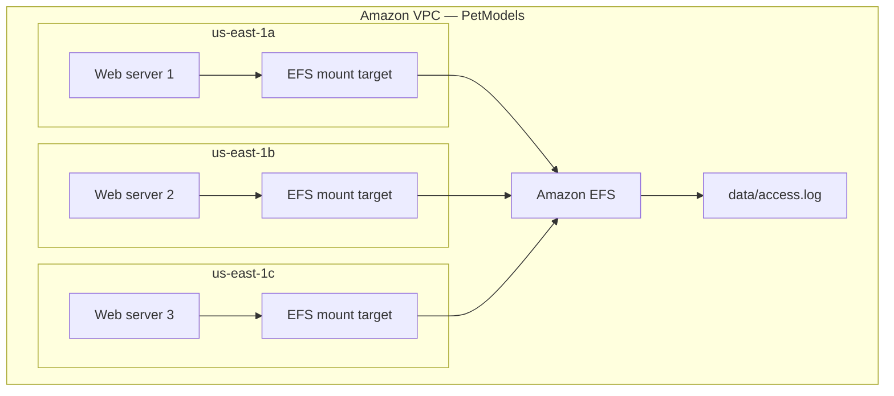

# Amazon EFS — Sistema de arquivos compartilhado e escalável

Laboratório prático do AWS SimuLearn sobre a implementação de um sistema de arquivos gerenciado e compartilhado entre instâncias Amazon EC2 distribuídas em três Zonas de Disponibilidade.

## Cenário

Três servidores web precisam acessar o mesmo conjunto de arquivos de configuração, imagens e logs. Armazenar esses dados somente no disco local de cada instância criaria cópias isoladas e aumentaria o esforço de sincronização.

A solução utiliza o **Amazon Elastic File System (Amazon EFS)**, com um mount target em cada Zona de Disponibilidade e comunicação NFS restrita por Security Groups.

## Arquitetura




## Serviços e recursos utilizados

| Recurso | Finalidade |
|---|---|
| Amazon EFS | Sistema de arquivos compartilhado e elástico |
| Amazon EC2 | Três servidores clientes do EFS |
| Amazon VPC | Isolamento lógico da rede `PetModels` |
| EFS mount targets | Endpoints NFS nas três Zonas de Disponibilidade |
| AWS Systems Manager Session Manager | Acesso administrativo às instâncias sem exposição direta de SSH |
| Security Groups | Controle do tráfego NFS/TCP 2049 |
| `amazon-efs-utils` | Cliente e ferramentas para montagem do EFS com TLS |

## Implementação

### 1. Proteção do acesso NFS

Foi criado o Security Group `PetModels-EFS-1-SG` na VPC `PetModels`.

| Regra | Protocolo | Porta | Origem |
|---|---|---:|---|
| NFS | TCP | 2049 | Security Group dos servidores web `sg-01cd5e7079e6ba91b` |

O uso de um Security Group como origem evita liberar o NFS publicamente e permite que somente as instâncias autorizadas iniciem a conexão.


### 2. Preparação dos servidores

O acesso às instâncias foi realizado pelo AWS Systems Manager Session Manager. Nos servidores, foi instalado o pacote necessário para montar o EFS:

```bash
sudo -i
yum install -y amazon-efs-utils
```

Evidências da instalação:

- [Web server 1](evidences/03-webserver1-efs-utils.png)
- [Web server 2](evidences/06-webserver2-efs-utils.png)

### 3. Expansão para a terceira Zona de Disponibilidade

O desafio DIY solicitou a criação de um terceiro endpoint EFS na instância localizada em `us-east-1c`. Foi adicionado um mount target nessa zona, associado ao Security Group `PetModels-EFS-1-SG`.

O sistema de arquivos utilizado foi `fs-0ad43abc7387e8005`, dentro da VPC `PetModels`. A tela de acesso de rede mostra mount targets em `us-east-1a`, `us-east-1b` e a configuração do novo target em `us-east-1c`.


### 4. Compartilhamento e validação

O fluxo validado pelo laboratório foi:

1. Web server 1 escreveu `A` no arquivo compartilhado.
2. Web server 2 escreveu `B` no mesmo arquivo.
3. Web server 3 foi conectado ao EFS e acrescentou `C` ao log.
4. O arquivo `data/access.log` permaneceu acessível por meio das instâncias conectadas ao mesmo sistema de arquivos.


## Troubleshooting

### Erro: `mount point does not exist`

Na primeira tentativa de montagem, o terminal retornou:

```text
mount: efs: mount point does not exist.
```

O erro indica que o diretório local usado como destino da montagem ainda não existia. Antes de executar o comando `mount`, é necessário criar o ponto de montagem, por exemplo:

```bash
mkdir -p /efs
mount -t efs -o tls fs-0ad43abc7387e8005:/ /efs
```

Também foi necessário instalar `amazon-efs-utils`, que fornece o helper de montagem do Amazon EFS e suporta a opção `tls`.

## Segurança

- A porta NFS `2049` foi restrita ao Security Group dos servidores web.
- A montagem utilizou a opção `tls`, protegendo os dados em trânsito.
- O Session Manager permitiu acesso às instâncias sem abrir a porta SSH `22` para a internet.
- Os mount targets foram mantidos dentro da VPC.
- A saída `0.0.0.0/0` observada no laboratório é ampla e deve ser reavaliada em produção conforme as dependências reais.

## Resultado

O laboratório foi concluído com sucesso. A solução final disponibilizou um sistema de arquivos EFS compartilhado entre três instâncias EC2 distribuídas em três Zonas de Disponibilidade.

Foram validados:

- criação e configuração do Amazon EFS;
- montagem do sistema de arquivos em instâncias EC2;
- conexão de uma terceira instância ao mesmo EFS;
- compartilhamento do arquivo entre os servidores;
- controle de acesso NFS por Security Group.


## Conceitos consolidados

### Amazon EFS

Armazenamento de arquivos gerenciado e elástico, adequado quando múltiplas instâncias Linux precisam acessar simultaneamente a mesma estrutura de diretórios.

### Mount target

Interface de rede do EFS criada em uma sub-rede. Ter um mount target em cada Zona de Disponibilidade usada pela aplicação reduz dependências entre zonas e melhora a disponibilidade do acesso.

### EFS, EBS ou S3?

| Serviço | Melhor aplicação |
|---|---|
| Amazon EFS | Sistema de arquivos Linux compartilhado por múltiplas instâncias |
| Amazon EBS | Volume de blocos para uma instância ou workload específico |
| Amazon S3 | Armazenamento de objetos acessado por API, sem semântica tradicional de filesystem |

## Aprendizados principais

- Um sistema distribuído não deve depender de arquivos mantidos isoladamente no disco local de cada servidor.
- Alta disponibilidade exige alinhar computação, rede e armazenamento entre as Zonas de Disponibilidade.
- O EFS resolve o compartilhamento, mas a conectividade depende de mount targets, rotas, DNS e regras NFS corretas.
- Erros de montagem podem ocorrer tanto por configuração de rede quanto pela ausência do diretório local ou das ferramentas do cliente.

---

Laboratório realizado por **José Airton de Carvalho Neto** como parte dos estudos em AWS, Cloud Computing e AWS re/Start.
